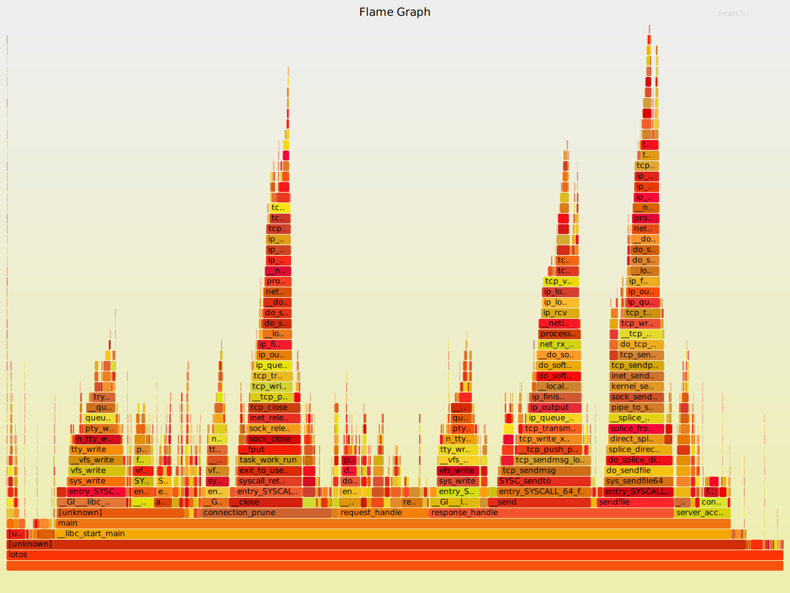
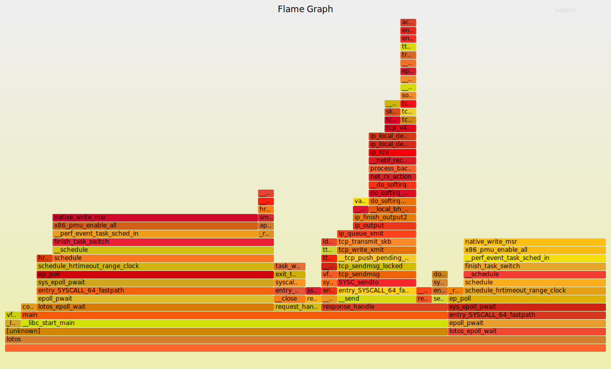
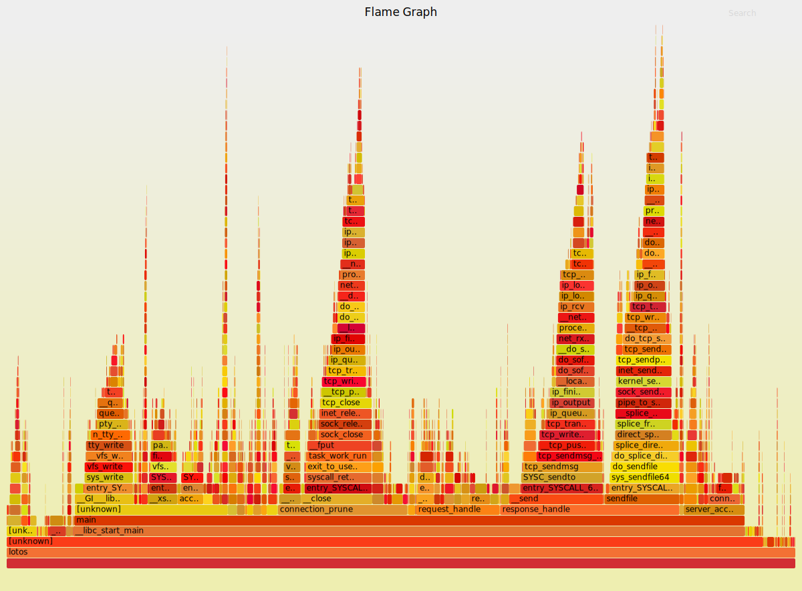
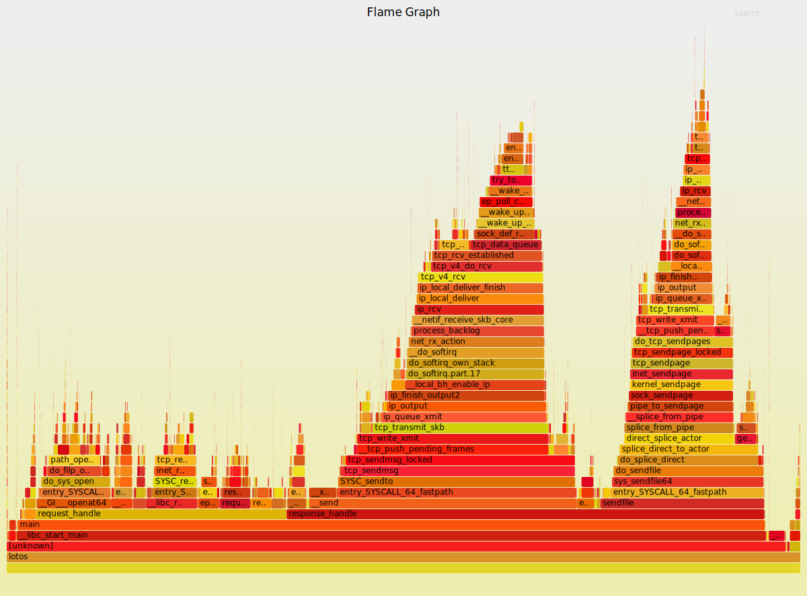

# 问题1

## 问题描述

使用`wrk`进行压力测试，发现`Avg Req/Sec`只有10^2数量级，显然不符合预期。请求返回的`Avg Latency` 也在40ms左右，在单机测试的环境下，这也是很长的响应时间了。

下面是wrk的测试报告：
```
$ wrk -t5 -c10 -d10s http://localhost:8888/ -vvv
wrk  [epoll] Copyright (C) 2012 Will Glozer
wrk  [epoll] Copyright (C) 2012 Will Glozer
wrk  [epoll] Copyright (C) 2012 Will Glozer
Running 10s test @ http://localhost:8888/
  5 threads and 10 connections
  Thread Stats   Avg      Stdev     Max   +/- Stdev
    Latency    43.72ms    3.16ms  49.97ms   99.21%
    Req/Sec    45.68      6.97    60.00     88.00%
  2284 requests in 10.01s, 333.74KB read
Requests/sec:    228.12
Transfer/sec:     33.33KB

```

## Debug记录

一开始猜测是在某个函数上开销比较大，但是函数太多，具体到某个函数又不容易定位。于是想起可以用`on-cpu 火焰图`分析函数执行耗时。

针对是否使用http keep-alive选项，对`lotos`使用两种模式的压力测试。

- `ab`版本

  ab版本不加keep-alive，纯http1.0模式，得到

- `wrk`版本

  采用http/1.1协议，支持keep-alive，得到

ab版本的火焰图很符合预期，每次都会建立、断开tcp连接，请求、回复的handler占有的比重也很正常，总之是个很漂亮的火焰图😉。

相比ab版本，发现wrk版本在epoll_wait上等待较多，cpu的采样点也少得可怜，可以大胆猜测应该是在某处IO上阻塞了。

我给`lotos`的主事件循环中加入了一些调试信息，采用`curl`命令发起keep-alive请求，命令如下
```
curl localhost:8000 localhost:8000 -vvv
```
命令的返回如下：
```
$ curl localhost:8888 -o /dev/null localhost:8888 -o /dev/null  -vvv
* Rebuilt URL to: localhost:8888/
  % Total    % Received % Xferd  Average Speed   Time    Time     Time  Current
                                 Dload  Upload   Total   Spent    Left  Speed
  0     0    0     0    0     0      0      0 --:--:-- --:--:-- --:--:--     0*   Trying ::1...
* TCP_NODELAY set
* connect to ::1 port 8888 failed: 連線被拒絕
*   Trying 127.0.0.1...
* TCP_NODELAY set
* Connected to localhost (127.0.0.1) port 8888 (#0)
> GET / HTTP/1.1
> Host: localhost:8888
> User-Agent: curl/7.57.0
> Accept: */*
>
< HTTP/1.1 200 OK
< Date: Tue, 30 Jan 2018 07:08:59 GMT
< Server: lotos/0.1
< Content-Type: text/html
< Content-Length: 6
< Connection: keep-alive
<
{ [6 bytes data]
100     6  100     6    0     0      6      0  0:00:01 --:--:--  0:00:01   666
* Connection #0 to host localhost left intact
* Rebuilt URL to: localhost:8888/
* Found bundle for host localhost: 0x55fc045f4460 [can pipeline]
* Re-using existing connection! (#0) with host localhost
* Connected to localhost (127.0.0.1) port 8888 (#0)
> GET / HTTP/1.1
> Host: localhost:8888
> User-Agent: curl/7.57.0
> Accept: */*
>
< HTTP/1.1 200 OK
< Date: Tue, 30 Jan 2018 07:08:59 GMT
< Server: lotos/0.1
< Content-Type: text/html
< Content-Length: 6
< Connection: keep-alive
<
{ [6 bytes data]
100     6  100     6    0     0      6      0  0:00:01 --:--:--  0:00:01     6
* Connection #0 to host localhost left intact

```

输出中的`Re-using existing connection! (#0) with host localhost`确实表明了curl确实重用了这条tcp连接。

对应的`lotos`的调试信息：
```
epoll: 0
epoll: 0
epoll: 1
[2018-01-30 10:12:25] fd:  6 127.0.0.1:43556

[2018-01-30 10:12:25] malloc 0x56418c766c70 1

[2018-01-30 10:12:25] ---------------accept

epoll: 1
0x56418c766c70 in 6
[2018-01-30 10:12:25] 0---------------in 108 us

[2018-01-30 10:12:25] 0---------------out 0 us

epoll: 1
[2018-01-30 10:12:25] 0---------------in 0 us

0x56418c766c70 out 6
send 143 bytes
send 0 bytes
[2018-01-30 10:12:25] 0---------------out 130 us

epoll: 1
0x56418c766c70 in 6
[2018-01-30 10:12:25] 0---------------in 51 us

[2018-01-30 10:12:25] 0---------------out 0 us

epoll: 1
[2018-01-30 10:12:25] 0---------------in 0 us

0x56418c766c70 out 6
send 143 bytes
send 0 bytes
[2018-01-30 10:12:25] 0---------------out 87 us

epoll: 0
epoll: 0
epoll: 1
0x56418c766c70 in 6
[2018-01-30 10:12:25] -1---------------in 27 us

[2018-01-30 10:12:25] -1---------------out 0 us

[2018-01-30 10:12:25] prune 0x56418c766c70 1

epoll: 0
epoll: 0
epoll: 0
epoll: 0
```

问题出现了，
```
0x56418c766c70 out 6
send 143 bytes
send 0 bytes
[2018-01-30 10:12:25] 0---------------out 87 us

epoll: 0
epoll: 0
epoll: 1
0x56418c766c70 in 6
[2018-01-30 10:12:25] -1---------------in 27 us
```

在最后一次给客户端发送完之后，`epoll_wait`出现了两次等待超时！！！很神奇！！！压力测试的工具竟然会延迟给我返回数据？ 或者，是我的程序发送数据存在延迟??? 可是我已经设置了禁用Nagle算法!!!(大四的网络程序设计课吃过瘪，很有印象)。

掏出神器strace执行`strace -tt ./lotos -r /tmp -t 10 -w 4 -d`，发现确实存在两次`epoll_wait`的超时，正好是40ms的阻塞。
```
00:39:34.964433 sendfile(7, 8, NULL, 6) = 6
00:39:34.964535 sendfile(7, 8, NULL, 6) = 0
00:39:34.964616 close(8)                = 0
00:39:34.964692 epoll_ctl(5, EPOLL_CTL_MOD, 7, {EPOLLET, {u32=717054400, u64=94206529724864}}) = 0
00:39:34.964776 epoll_ctl(5, EPOLL_CTL_MOD, 7, {EPOLLIN|EPOLLET, {u32=717054400, u64=94206529724864}}) = 0
00:39:34.964858 epoll_pwait(5, [], 10240, 20, NULL, 8) = 0
00:39:34.985093 epoll_pwait(5, [], 10240, 20, NULL, 8) = 0
00:39:35.005413 epoll_pwait(5, [{EPOLLIN, {u32=717054400, u64=94206529724864}}], 10240, 20, NULL, 8) = 1
00:39:35.006764 recvfrom(7, "GET / HTTP/1.1\r\nHost: 192.168.1."..., 8192, 0, NULL, NULL) = 44
00:39:35.006875 recvfrom(7, 0x7ffe23f19810, 8192, 0, NULL, NULL) = -1 EAGAIN (Resource temporarily unavailable)
00:39:35.006929 openat(3, "./", O_RDONLY) = 6
00:39:35.007000 fstat(6, {st_mode=S_IFDIR|S_ISVTX|0777, st_size=840, ...}) = 0
00:39:35.007104 openat(6, "index.html", O_RDONLY) = 8

```
掏出wireshark抓包看也是一切正常。囧了。google搜索也没给出答案（关键词不对:sweat:

后来我发现不论`epoll_wait`的超时值设为多少，`Avg Latency` 总是在40ms左右。于是把`40ms`作为关键词google之，发现还真是Nagle算法的问题。估计是我代码写错了吧，去排查一下，发现果真对文件描述符0做了设置TCP_NODELAY的操作！！！我真的是写bug的程序员...

修改了代码之后，问题瞬间就不存在了。
重新生成火焰图，

- `ab`版本

  ab版本不加keep-alive，纯http1.0模式，得到

- `wrk`版本

  采用http/1.1协议，支持keep-alive，得到

  关于Nagle算法，我觉得这篇文章已经讲得很清晰[《神秘的40毫秒延迟与 TCP_NODELAY》](http://jerrypeng.me/2013/08/mythical-40ms-delay-and-tcp-nodelay/)。

  lotos的设计上确实也是http headers和body分开发送，所以headers被立即发送("send data immediately")，body则被放在缓冲区里面("enqueue data in the buffer until an acknowledge is received")，直到对面40ms的超时ACK来临，才会把body发送出去。

  好吧，虽然我知道很多服务器都设置TCP_NODELAY，包括nginx，以前也只是经验性的设置一下该选项，直到今天踩了坑，才对这玩意有更深的理解。调试过程也是一个学习成长的过程！
